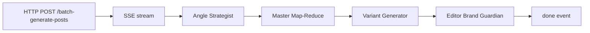

# Batch Social Posts Generation

Tai lieu ky thuat chi tiet cho chuc nang Batch Social Posts Generation, bao gom backend flow, agents, va frontend UX/SSE.

## 1. Muc tieu

Batch generation cho phep tao nhieu master posts tu nhieu angle, sau do fan-out sang nhieu platform variants, va cuoi cung chay brand-guardian kiem tra toan bo output.

Dau vao chinh:
- `campaign_id`: id cua chien dich
- `workspace_id`: id workspace
- `language`: ngon ngu sinh noi dung
- `platforms`: danh sach kenh (facebook, instagram, linkedin, twitter, tiktok, youtube, blog, email)
- `num_masters`: so luong master posts can tao (cung la so angles)

Dau ra chinh:
- `mastersCount`: so master da tao
- `variantsCount`: so variants da tao
- `editorFlags`: cac canh bao tu brand guardian

## 2. Backend Flow (FastAPI + Agents)

Endpoint:
- `POST /batch-generate-posts` (SSE)

File lien quan:
- `app/services/batch_generator.py`
- `app/main.py`
- `app/prompts.py`
- `angle_strategist_agent/*`
- `master_content_agent/*`
- `variant_generator_agent/*`
- `editor_brand_guardian_agent/*`

### 2.1 Flow tong quan

Mermaid (logic):



### 2.2 Angle Strategist

- Nhiem vu: tao danh sach `angles` (moi angle gom `angle_name`, `funnel_stage`, `psychological_angle`, `key_message_variation`, `brief`).
- Output: `generated_angles`.
- Duoc goi trong `batch_generate_event_stream()`.

Pseudo:

```python
angle_state = {
    "campaign_id": campaign_id,
    "workspace_id": workspace_id,
    "language": language,
    "num_angles": num_masters,
    ...
}
angle_config = {"configurable": {"thread_id": "angles_<id>"}}
await angle_strategist_graph.ainvoke(angle_state, config=angle_config)
```

### 2.3 Master Map-Reduce (LangGraph Send API)

- Map: moi `angle` chay `master_content_graph` doc lap.
- Reduce: gom danh sach `master_results`.
- Dung `Send` de fan-out.

Key points:
- Checkpointer: `MemorySaver()` -> bat buoc co `thread_id` trong `config`.
- Dung `asyncio.Semaphore` de gioi han so request dong thoi (tranh 429).

Pseudo:

```python
workflow.add_conditional_edges(START, send_to_master_nodes)

# fan-out
return [
  Send("MasterFromAngle", {..., "angle": angle})
  for angle in state["angles"]
]

master_config = {"configurable": {"thread_id": "master_map_<id>"}}
await master_graph.ainvoke(master_state, config=master_config)
```

### 2.4 Master Content Agent

- Retriever: lay campaign, worksheet, brand, persona tu MCP.
- Generator: sinh JSON master content, su dung `angle_context` de tao variation.
- Evaluator: kiem tra JSON, `core_message`, length, retry neu can.
- Saver: trong flow batch, da luu `master_contents` sau khi generate.

### 2.5 Variant Generator

- Input: `master_content_id`, `platforms`.
- Output: `platform_variants` luu vao PocketBase.
- Dung `asyncio.gather` va `Semaphore` de chay song song.

### 2.6 Editor Brand Guardian

- Input: danh sach masters + variants.
- Output: `validation_results.flags` neu co vi pham brand voice.
- Loi se bi log, khong block toan bo batch (chi warning).

## 3. Concurrency va Rate Limit

File: `app/services/batch_generator.py`

- `BATCH_MAX_CONCURRENT` (env) -> gioi han so LLM calls dong thoi.
- Dung `asyncio.Semaphore(max_concurrent)` trong 2 step:
  - Master generation (Map-Reduce)
  - Variant generation

Default: 5 (neu khong set env).

## 4. SSE Events (Backend)

SSE event types:
- `status`: thong bao tien trinh
- `warn`: canh bao ket noi bi ngat, task van chay o server
- `error`: loi nghiem trong, dung flow
- `done`: hoan thanh batch

Vi du payload:

```json
{
  "event": "status",
  "data": {
    "status": "active",
    "agent": "Batch",
    "step": "Generated 3 angles. Creating master posts..."
  }
}
```

## 5. Frontend Flow (React)

File lien quan:
- `src/hooks/useAIContentGeneration.ts`
- `src/components/social-posts/BatchGenerateModal.tsx`
- `src/components/social-posts/ActivityLog.tsx`
- `src/components/Toast.tsx`
- `src/pages/SocialPostsPage.tsx`

### 5.1 UI Flow

1. User mo `BatchGenerateModal`.
2. Chon: campaign, language, platforms, num_masters.
3. Submit -> goi SSE `POST /batch-generate-posts`.
4. `ActivityLog` show progress.
5. Hoan thanh -> toast + action reload.

### 5.2 SSE Resilience

Hook `useAIContentGeneration`:
- Neu ket noi SSE bi ngat (TypeError), hook phat `warn` event thay vi fail.
- UI se hien thong bao: "Dang chay ngam tren server..." sau 30s.

### 5.3 Toast action

`Toast.tsx` ho tro `actionText` va `onAction` de user reload danh sach khi batch xong.

## 6. Data Mapping

Collections PocketBase lien quan:
- `master_contents`
- `platform_variants`

Metadata luu trong `metadata` (JSON string), vi du:
- Master: `tone_markers`, `suggested_hashtags`, `key_benefits`, `confidence_score`, `angle`.
- Variant: `hashtags`, `call_to_action`, `character_count`, `optimization_notes`, `seo_*`.

## 7. Error Handling va Troubleshooting

### 7.1 Checkpointer error

Symptom:
- "Checkpointer requires one or more of the following 'configurable' keys: thread_id, checkpoint_ns, checkpoint_id"

Fix:
- Dam bao moi graph compiled voi checkpointer deu co `configurable.thread_id` khi goi `invoke/ainvoke`.

### 7.2 Prompt format KeyError

Symptom:
- `KeyError: '\n        "angle_name"'`

Fix:
- Escape JSON braces trong prompt template: `{{` va `}}`.

### 7.3 429 Too Many Requests

Fix:
- Giam `BATCH_MAX_CONCURRENT`.
- Bat `Semaphore` de throttle.

## 8. Env Vars

| Env Var | Mo ta | Default |
| --- | --- | --- |
| `BATCH_MAX_CONCURRENT` | So luong request LLM song song | `5` |

## 9. Testing

Goi y test:
- Unit: `pytest tests/unit` (kien thuc chung).
- Manual: thao tac tren UI, theo doi SSE log.
- Backend: goi API bang curl va check SSE.

Example curl:

```bash
curl -N -X POST http://localhost:8000/batch-generate-posts \
  -H "Content-Type: application/json" \
  -d '{
    "campaign_id": "...",
    "workspace_id": "...",
    "language": "Vietnamese",
    "platforms": ["facebook", "instagram"],
    "num_masters": 3
  }'
```

---

Generated: 2026-02-20

Flow:

flowchart TB
    %% --- Định nghĩa Style ---
    classDef frontend fill:#e1f5fe,stroke:#01579b,stroke-width:2px;
    classDef backend fill:#f3e5f5,stroke:#4a148c,stroke-width:2px;
    classDef agent fill:#e8f5e9,stroke:#1b5e20,stroke-width:2px;
    classDef database fill:#fff3e0,stroke:#e65100,stroke-width:2px;
    classDef sse fill:#ffebee,stroke:#b71c1c,stroke-width:2px,stroke-dasharray: 5 5;
    classDef mcp fill:#eceff1,stroke:#263238,stroke-width:2px;

    %% --- FRONTEND ---
    subgraph Frontend ["🖥️ Frontend (React)"]
        UI_Modal([BatchGenerateModal])
        InputData[/Input: campaign, language, platforms, masters/]
        Hook([useAIContentGeneration Hook])
        UI_Log([ActivityLog])
        UI_Toast([Toast / Action Reload])

        UI_Modal --> InputData
        InputData --> Hook
        Hook --> UI_Log
    end

    %% --- BACKEND API ---
    subgraph BackendAPI ["⚙️ Backend API (FastAPI)"]
        API_Endpoint(POST /batch-generate-posts)
        SSE_Stream{{SSE Streamer}}
        
        Hook -- HTTP POST --> API_Endpoint
        API_Endpoint --> SSE_Stream
        SSE_Stream -. events: status, warn, error, done .-> Hook
        
        %% SSE Resilience
        Hook -. 30s timeout / Network Error .-> UI_Toast
    end

    %% --- LANGGRAPH ORCHESTRATION ---
    subgraph Workflow ["🤖 LangGraph Agents Workflow"]
        
        %% Angle Strategist
        Agent_Angle{{1. Angle Strategist Agent}}
        Config_Angle[config: thread_id]
        
        %% Master Map-Reduce
        subgraph MapReduce ["2. Master Map-Reduce (Fan-out)"]
            Limit1((Semaphore BATCH_MAX))
            SendAPI[LangGraph Send API]
            
            subgraph MasterAgent ["Master Content Agent (Per Angle)"]
                direction TB
                M_Retriever[Retriever]
                M_Generator[Generator JSON]
                M_Evaluator{Evaluator}
                M_Saver[Saver]
                
                M_Retriever --> M_Generator
                M_Generator --> M_Evaluator
                M_Evaluator -- Core message/Length Fails --> M_Generator
                M_Evaluator -- Valid JSON --> M_Saver
            end
            
            Reduce[Reduce: Gom danh sách master_results]
        end
        
        %% Variant Generator
        subgraph VariantGen ["3. Variant Generator Agent"]
            Limit2((Semaphore BATCH_MAX))
            AsyncGather[asyncio.gather Parallel]
            V_Generator[Generate Platform Variants]
            
            AsyncGather --> V_Generator
        end
        
        %% Brand Guardian
        Agent_Guardian{{4. Editor Brand Guardian Agent}}
        GuardianCheck{Check Brand Voice}
        
    end

    %% --- DATABASE & EXTERNAL ---
    subgraph Storage ["🗄️ Database & MCP"]
        DB_Master[(PocketBase: master_contents)]
        DB_Variant[(PocketBase: platform_variants)]
        MCP_Context[(MCP: Campaign, Worksheet, Brand, Persona)]
    end

    %% --- KẾT NỐI CÁC THÀNH PHẦN ---
    
    %% API to Graph
    API_Endpoint ==>|Trigger Workflow| Agent_Angle
    Agent_Angle -. logs .-> SSE_Stream
    
    %% Angle to Master
    Agent_Angle ==>|Output: generated_angles| SendAPI
    Config_Angle -.-> Agent_Angle
    
    %% Master Flow
    SendAPI ==>|Map: each angle| Limit1
    Limit1 ==> M_Retriever
    MCP_Context -. cấp context .-> M_Retriever
    M_Saver ==>|Lưu Data| DB_Master
    M_Saver ==> Reduce
    Reduce -. logs .-> SSE_Stream
    
    %% Master to Variant
    Reduce ==>|master_results & platforms| Limit2
    Limit2 ==> AsyncGather
    V_Generator ==>|Lưu Data| DB_Variant
    V_Generator -. logs .-> SSE_Stream
    
    %% Variant to Guardian
    V_Generator ==>|masters + variants| Agent_Guardian
    Agent_Guardian ==> GuardianCheck
    GuardianCheck -- Vi phạm --> EditorFlags[Log Warnings / editorFlags]
    GuardianCheck -- Hợp lệ --> DoneEvent[Hoàn thành Batch]
    
    EditorFlags -. Cảnh báo không block luồng .-> DoneEvent
    DoneEvent ==>|Done Event| SSE_Stream
    DoneEvent ==> UI_Toast
    
    %% Gán class style
    class UI_Modal,InputData,Hook,UI_Log,UI_Toast frontend;
    class API_Endpoint backend;
    class Agent_Angle,Agent_Guardian,M_Retriever,M_Generator,M_Evaluator,M_Saver,V_Generator agent;
    class DB_Master,DB_Variant database;
    class MCP_Context mcp;
    class SSE_Stream sse;                      